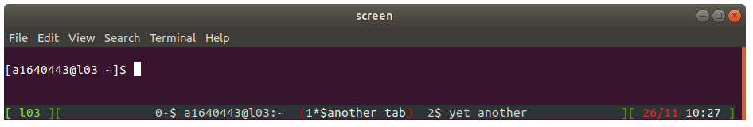
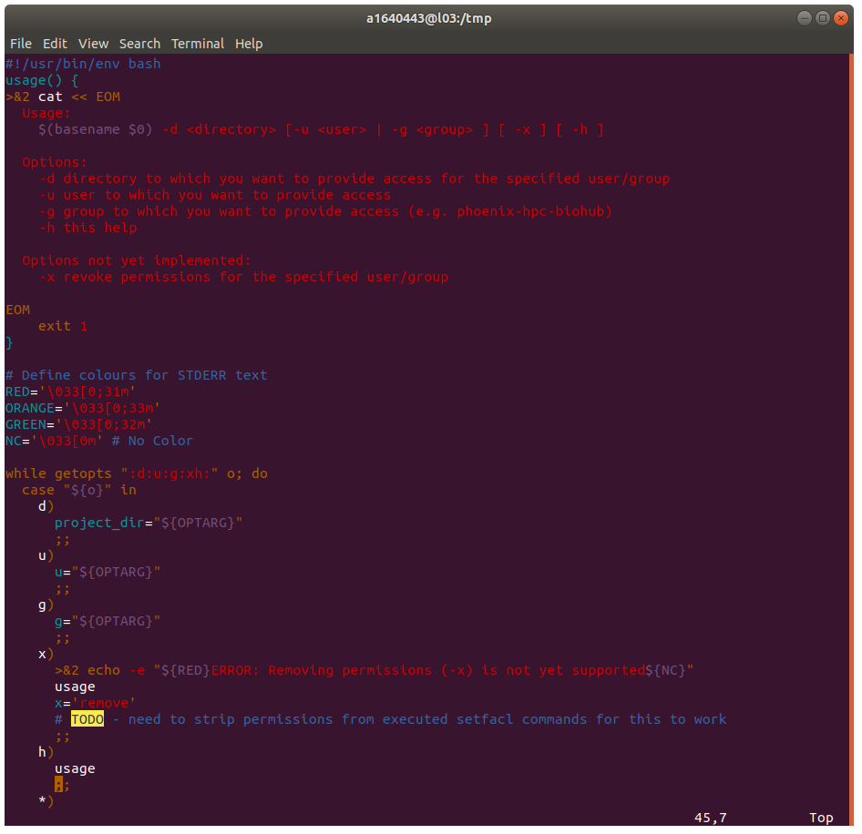
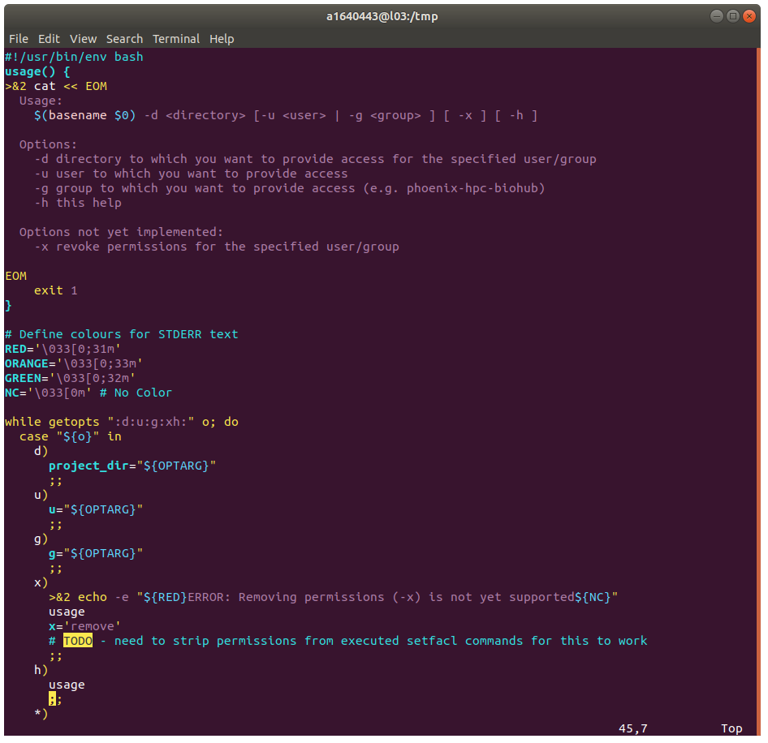

Useful user configuration files to modify the default behaviour of tools on `phoenix`.

 * [~/.screenrc](.screenrc) - Provides a nice "tab-bar" at the bottom of the terminal when using a `screen` session.
 
 * [~/.vimrc](.vimrc) - Use colours appropriate for terminals which have a dark background.
 
 
 * [~/.inputrc](.inputrc) - Configuration file for GNU Readline
 * [~/.condarc](.condarc) - Get conda to save environments and package files under `/fast/users/$USER/.conda/` rathen than `~/.conda/`.
